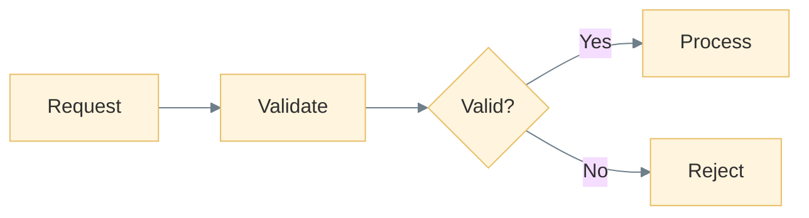
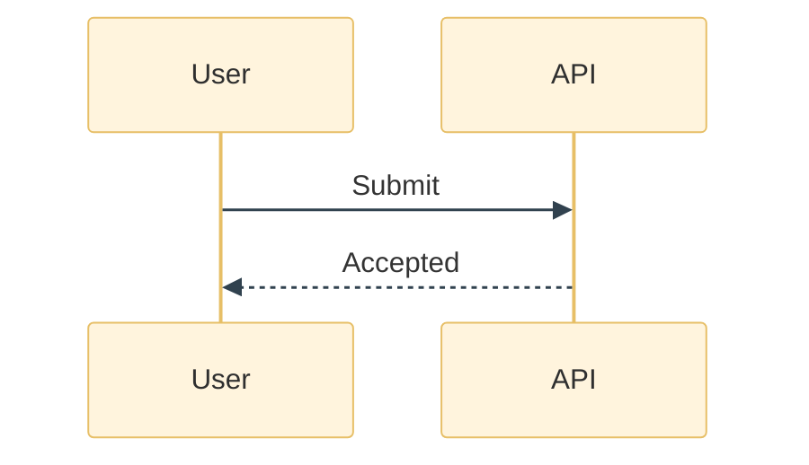
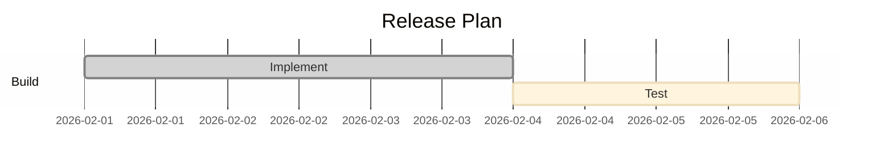

# Mermaid Design Examples

## Flowchart

```mermaid
%%{init: {"theme":"base","themeVariables":{"primaryColor":"#fff4dd","primaryBorderColor":"#e7bf67","primaryTextColor":"#2f2f2f","lineColor":"#6f7f8a"}}}%%
flowchart LR
  A["Request"] --> B["Validate"]
  B --> C{"Valid?"}
  C -->|"Yes"| D["Process"]
  C -->|"No"| E["Reject"]
```

## Sequence Diagram

```mermaid
%%{init: {"theme":"base","themeVariables":{"actorBkg":"#fff4dd","actorBorder":"#e7bf67","actorTextColor":"#2f2f2f","signalColor":"#31424f"}}}%%
sequenceDiagram
  participant U as User
  participant API as API
  U->>API: Submit
  API-->>U: Accepted
```

## Gantt

```mermaid
%%{init: {"theme":"base","themeVariables":{"primaryColor":"#fff4dd","primaryTextColor":"#2f2f2f","lineColor":"#6f7f8a"}}}%%
gantt
  title Release Plan
  dateFormat YYYY-MM-DD
  section Build
  Implement: done, i1, 2026-02-01, 3d
  Test: t1, after i1, 2d
```
