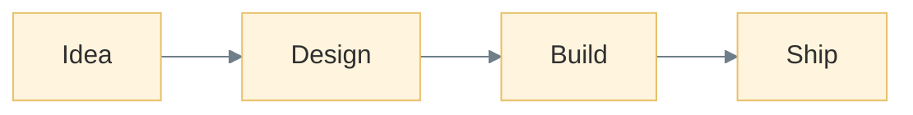
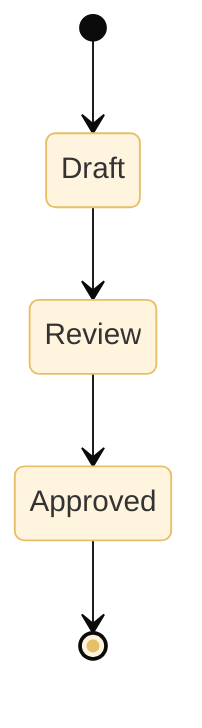
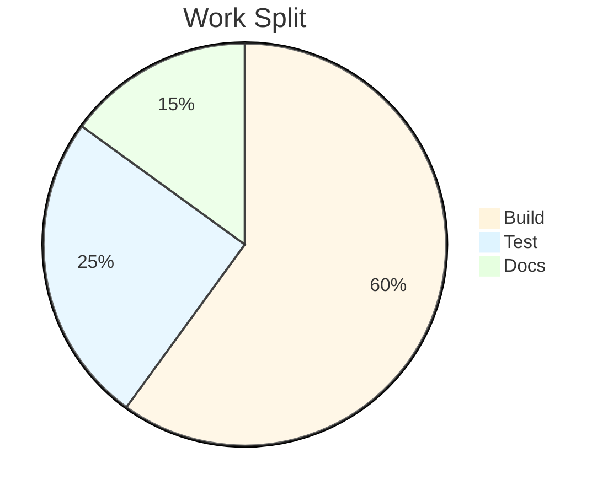

# Mermaid Sleek Examples

## Flowchart

```mermaid
%%{init: {"theme":"base","themeVariables":{"background":"#f4f4f4","primaryColor":"#fff4dd","primaryTextColor":"#2f2f2f","primaryBorderColor":"#e7bf67","lineColor":"#6f7f8a"}}}%%
flowchart LR
  A["Idea"] --> B["Design"]
  B --> C["Build"]
  C --> D["Ship"]
```

## State Diagram

```mermaid
%%{init: {"theme":"base","themeVariables":{"background":"#f4f4f4","primaryColor":"#fff4dd","primaryBorderColor":"#e7bf67","tertiaryColor":"#e6ffe0"}}}%%
stateDiagram-v2
  [*] --> Draft
  Draft --> Review
  Review --> Approved
  Approved --> [*]
```

## Pie

```mermaid
%%{init: {"theme":"base","themeVariables":{"pie1":"#fff4dd","pie2":"#dff4ff","pie3":"#e6ffe0","pieStrokeColor":"#2f2f2f","pieStrokeWidth":"2px"}}}%%
pie title Work Split
  "Build" : 60
  "Test" : 25
  "Docs" : 15
```
