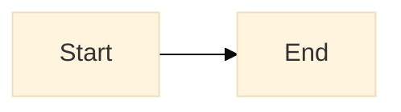

# Mermaid Design Reference

## Required output pattern

1. Read root `mermaid.tokens.json`.
2. Emit init block first.
3. Emit requested diagram syntax.

## Validation checklist

- Root `mermaid.tokens.json` exists.
- Init block is present and uses root tokens.
- Diagram syntax matches requested type.
- No unnecessary inline style overrides.
